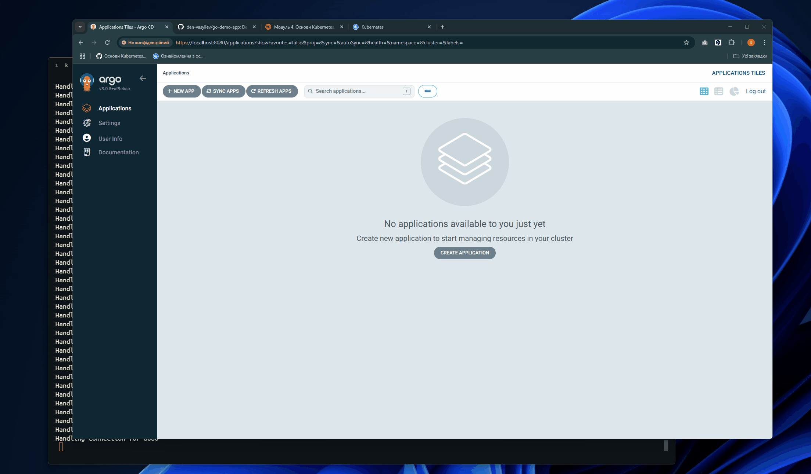

# MVP Deployment with ArgoCD

## Purpose

Demonstrate how ArgoCD automatically deploys and synchronizes the [go-demo-app](https://github.com/den-vasyliev/go-demo-app) from a Git repository to a Kubernetes cluster created with k3d.

## Demonstration


## Usful Commands

Check application status:

```bash
kubectl get applications -n argocd
```

Port-forward the ambassador app (if needed):

```bash
kubectl port-forward -n go-demo-app svc/ambassador 8088:80
```

Lists all services running in the go-demo-app namespace, displaying their names, types (such as ClusterIP or NodePort), cluster IP addresses, ports, and other relevant information.

```bash
kubectl get svc -n go-demo-app
```