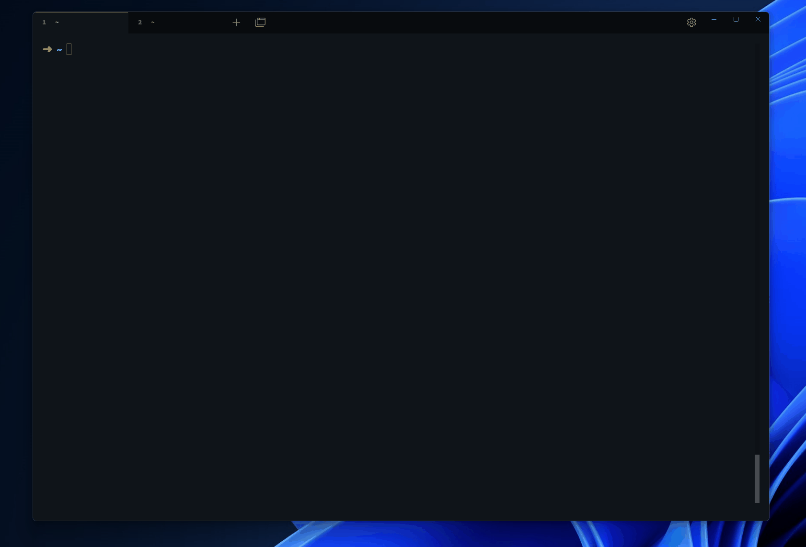

# Proof of Concept: Deploying ArgoCD on k3d for AsciiArrify

## Purpose

Demonstrate the ability to deploy ArgoCD GitOps system in a kubernetes cluster created with k3d.

## Requirements

- Linux (Ubuntu 20.04 or later)
- [Kubectl](https://kubernetes.io/docs/tasks/tools/)
- [k3d](https://k3d.io/)
- [Docker](https://docs.docker.com/get-docker/)

## 1. Create a Kubernetes Cluster with k3d

```bash
k3d cluster create argocd-cluster
```

Check the status:

```bash
k3d cluster list
```
## 2. Install ArgoCD
```bash
kubectl create namespace argocd
kubectl apply -n argocd -f https://raw.githubusercontent.com/argoproj/argo-cd/stable/manifests/install.yaml
```
## 3. Expose ArgoCD API Server
```bash
kubectl port-forward svc/argocd-server -n argocd 8080:443
```
## 4. Access ArgoCD UI
Open your web browser and navigate to `http://localhost:8080`.

## 5. Login to ArgoCD
The default username is `admin`. To get the password, run:

```bash
kubectl get secret argocd-initial-admin-secret -n argocd -o jsonpath="{.data.password}" | base64 -d
```

## Demonstration (argocd)
